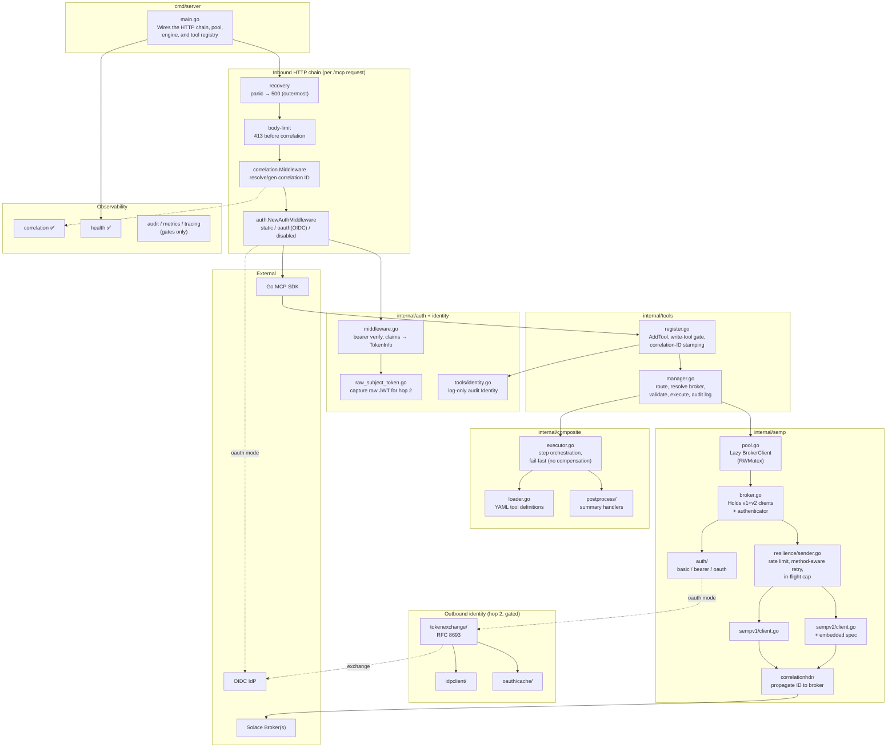
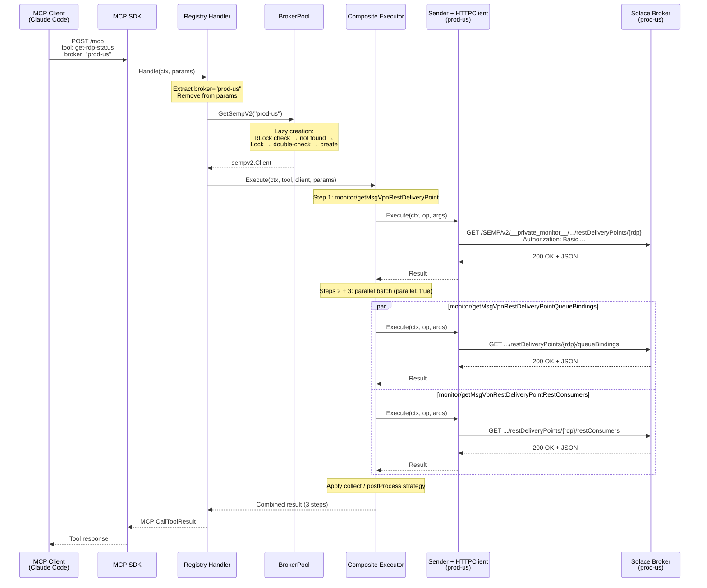
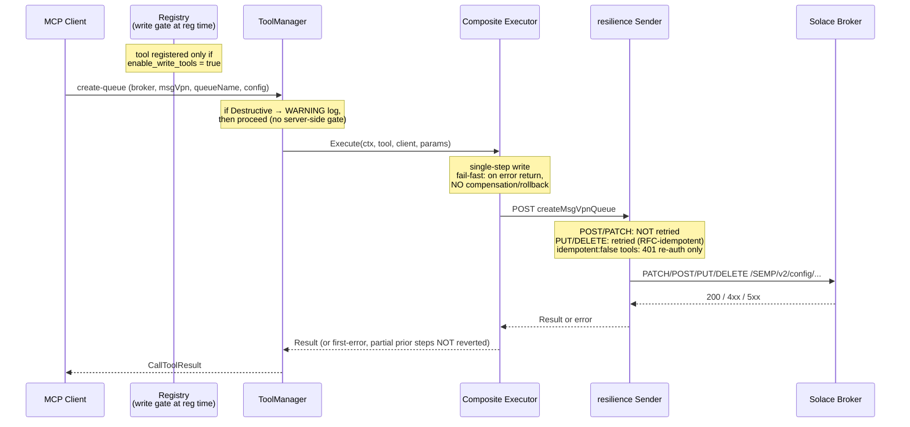
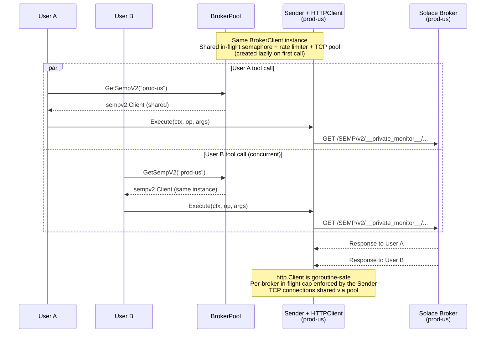
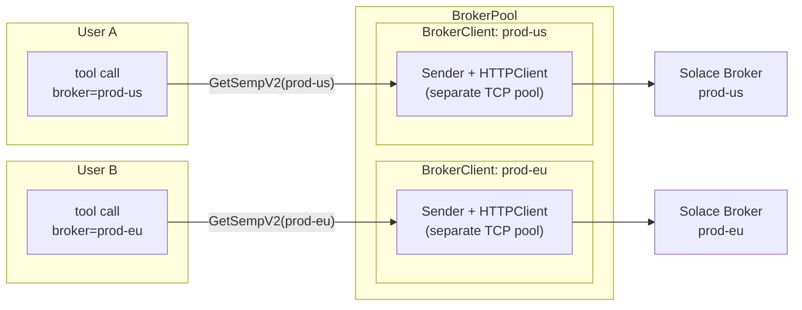

# Architecture — Solace Broker MCP Server

This document describes the architecture **as implemented**. Where a package
exists only as a capability gate or is wired behind a feature flag, that status
is called out inline (e.g. _skeleton_, _gated_) so the doc never implies a
subsystem is live when the code is a stub. Component claims carry `file:line`
references so a reviewer can verify each one against the code.

For the trust boundaries implied by this design — what crosses them, what
mitigates each threat, and what's an explicit accepted risk — see
[`threat-model.md`](threat-model.md).

---

## Package Structure

One line per package; for current file-level detail, read the package itself.
The full tool list lives in `internal/composite/definitions/tools.yaml`
(composite) plus the native handler packages under `internal/tools/` — count
them there, not here.

```
cmd/server/                     Entry point — config load, HTTP chain (recovery→body-limit→correlation→auth), MCP startup, tool registration
internal/
├── auth/                       Inbound client auth: OIDC/JWT verifier, static dev token, disabled mode; raw subject-token capture for hop-2
│                               (principal.go is a skeleton — Principal is empty, no writer yet; SOL-151278)
├── banner/                     Operator-facing startup/validation banners (auth mode, OAuth guards, cleartext warnings)
├── config/                     YAML config, ${VAR} env substitution, validation, broker alias canonicalization
│                               (observability.go loads OBS_* flags + tunables)
├── defaults/                   Single source of truth for all default constants, with assumption annotations
├── idpclient/                  Shared IdP-bound HTTP client (TLS roots, bounded timeout) used by token exchange
├── middleware/
│   └── recovery/               Outermost whole-mux panic → clean-500 recovery wrapper
├── oauth/
│   └── cache/                  TokenCache interface + Otter-v2 implementation for exchanged broker tokens
│       └── cachetest/          Test helper: *testing.T-aware cache constructors with auto-Close
├── observability/
│   ├── audit/                  Capability gate only — audit-record emission not yet implemented (skeleton)
│   ├── correlation/            IMPLEMENTED: inbound correlation-ID middleware, context store, slog stamping (traceparent → X-Correlation-ID → UUIDv7)
│   ├── health/                 IMPLEMENTED: /livez, /health, /readyz probes; readiness decoupled from broker (ADR-004)
│   ├── metrics/                Capability gate only — instruments/export not yet implemented (skeleton)
│   ├── schema/                 Metrics/audit output schema-version constants
│   └── tracing/                Capability gate only — OTel tracer not yet implemented (skeleton)
├── safego/                     Run errgroup goroutines with a panic-recovery net
├── semp/                       BrokerPool + BrokerClient — lazy per-broker client creation, thread-safe (RWMutex)
│   ├── auth/                   Broker (outbound) auth: basic / bearer / oauth Authenticator implementations
│   ├── correlationhdr/         Writes correlation ID (X-Correlation-ID + traceparent) onto outbound SEMP requests
│   ├── resilience/             Sender: method-aware retries, cookie jar; reads the broker's shared rate limiter + in-flight cap
│   ├── sempv1/                 SEMPv1 client — XML envelope protocol
│   └── sempv2/                 SEMPv2 client — HTTP + embedded OpenAPI specs (private monitor + private config)
│       └── specs/              Embedded Swagger JSON: private monitor (reads) + private config (writes)
├── tokenexchange/              RFC 8693 token exchange (hop 2) — GATED behind Hop2OAuthActive(); cached + singleflight-deduped
├── composite/                  YAML-driven composite tool engine: loader, validator, step executor
│   ├── definitions/            tools.yaml — composite tool definitions (source of truth for the composite tool list)
│   └── postprocess/            postProcess result strategy: named Go handlers merged under a "summary" key
│       ├── handlers/           Concrete postprocessors (get-rdp-status, list-queues, list-vpns, …), self-register in init()
│       └── postprocesstest/    Test helper: registration with t.Cleanup unregister
├── tools/                      MCP registration, routing, param/output validation, audit-identity extraction, error sanitization
    ├── queuemetrics/           Native get-queue-metrics (mixed: SEMPv2 metrics + SEMPv1 live depth)
    ├── sempv1/                 Native SEMPv1 read handlers, one package per tool
    │   ├── brokerstatus/       get-broker-status (aggregates 5–6 SEMPv1 show commands)
    │   ├── discardstats/       get-discard-stats
    │   └── redundancy/         get-redundancy-status
    └── sempv2/                 Native SEMPv2 action handlers (write; gated by enable_write_tools)
        ├── clientactions/      disconnect-client, clear-client-stats
        └── queueactions/       delete-queue-messages, clear-queue-stats
└── version/                    Build-time version stamping via ldflags
```

---

## Component Overview



---

## Inbound Auth & Two-Hop Identity

The server is a **resource server on hop 1** — it validates inbound tokens but
is not the authorization authority; an external OIDC issuer is
(`internal/auth/middleware.go:135`). On **hop 2** (oauth broker mode) it
switches roles and acts as an **OAuth client** of the IdP, exchanging the
caller's token using its own registered client credentials
(`client_secret_basic`/`client_secret_post`, `internal/tokenexchange/request.go:111`).
Identity crosses two hops:

- **Hop 1 (inbound, always on when auth enabled):** validate the client's
  bearer token. `auth.NewAuthMiddleware` selects the backend by
  `mcp_client_auth.mode` (`internal/auth/middleware.go:40`): `disabled`
  (pass-through, no auth), `static` (constant-time compare against a dev token,
  returns a fixed `dev-user`; dev/test only, `middleware.go:102`), or `oauth`
  (OIDC signature/`iss`/`aud`/`exp` verification against the issuer's JWKS,
  `middleware.go:141`). Validated claims land on `req.Extra.TokenInfo`; each
  tool handler builds a **log-only** audit `Identity` from them
  (`internal/tools/identity.go:104`, carrying `sub`/`iss`/`client_id`/`jti`
  only — no access level or scope).

- **Hop 2 (outbound, GATED):** for brokers with `auth.mode: oauth`, the raw
  subject token captured at `internal/auth/raw_subject_token.go:59` is exchanged
  (RFC 8693, `internal/tokenexchange/exchange.go:30`) for a broker-scoped token,
  cached and singleflight-deduped. Hop 2 is built only when `Hop2OAuthActive()`
  is true (`cmd/server/main.go`); under `basic`/`bearer` broker auth a shared
  static credential is used instead.

```mermaid
sequenceDiagram
    participant Client as MCP Client
    participant Auth as Auth Middleware<br/>(hop 1)
    participant IdP as OIDC IdP
    participant Tool as Tool Handler
    participant SAuth as Broker Authenticator<br/>(hop 2, gated)
    participant Broker as Solace Broker

    Client->>Auth: Bearer <subject token>
    alt oauth mode
        Auth->>IdP: verify signature/iss/aud/exp (JWKS)
        IdP-->>Auth: valid claims
    end
    Note over Auth: TokenInfo → req.Extra;<br/>raw token → context (hop 2)
    Auth->>Tool: handler(ctx, params)
    Note over Tool: build log-only audit Identity<br/>(sub/iss/client_id/jti)
    alt broker auth.mode = oauth (gated)
        Tool->>SAuth: AddAuth(ctx)
        SAuth->>IdP: RFC 8693 token exchange (cached)
        IdP-->>SAuth: broker-scoped token
        SAuth->>Broker: SEMP call + exchanged token
    else basic / bearer
        Tool->>Broker: SEMP call + shared static credential
    end
```

**Authorization authority:** only in `oauth` broker mode does the caller's
identity reach the broker for per-caller authz. Under `basic`/`bearer`, the
broker authorizes a shared credential, not the individual caller.

---

## Request Flow — Read Tool Call



The executor supports two `result.strategy` values:

- **`collect`** — returns the raw step-result map keyed by step ID.
- **`postProcess`** — runs a Go handler registered in [`internal/composite/postprocess/`](../../internal/composite/postprocess/) over the step results and merges its summary map under a top-level `"summary"` key alongside the raw results. Handlers register from `init()`; `cmd/server/main.go` blank-imports the handlers package so registration happens before startup validation. At boot the server cross-checks each handler's `RequiredFields` against the union of its tool's step `select:` arrays and refuses to start on a mismatch (template: `tool %q: postprocessor %q reads %q but it is not in select`). This catches SEMP field-name drift before any tool call.

---

## Request Flow — Write / Action Tool Call

Write tools are **registered only when `enable_write_tools` is true** (default
false). The gate is a single check at registration
(`internal/tools/register.go:149`, `isWriteTool` = `!ReadOnly`,
`register.go:181`): a write tool that isn't registered never appears in
`tools/list` and cannot be invoked. This gates **every** state-changing tool —
destructive or not — so a default deployment exposes only the read set.

Two write families exist today:

| Family | Tools | HTTP method |
|---|---|---|
| Composite CRUD (`tools.yaml`) | `create/update/delete` × `message-vpn`, `queue`, `topic-endpoint`, `rdp` | POST / PATCH / DELETE |
| Native actions (`tools/sempv2/`) | `delete-queue-messages`, `clear-queue-stats`, `disconnect-client`, `clear-client-stats` | PUT |



### Write Safety Model (honest current state)

- **No compensation or rollback.** The engine is fail-fast: on any step error it
  returns immediately and does not undo completed steps
  (`internal/composite/executor.go:102`). Every shipped write tool is
  **single-step**, so there is no *cross-step* partial state today — but that is
  a property of the current tool definitions, not a guarantee the engine
  provides. Adding a multi-step write reintroduces partial-state risk.
- **Retries are decided by HTTP method, except where a tool declares
  otherwise.** POST/PATCH (`create`/`update`) are not retried; PUT/DELETE are
  retried on transient failures, on RFC 9110 §9.2.2 idempotency grounds. That
  inference is wrong for the `action/` namespace, which routes non-idempotent
  RPC over PUT, so a tool annotated `idempotent: false` now also suppresses
  replay: `CompositeExecutor.Execute` marks the request via
  `resilience.WithRetryUnsafe`, and the retry policy then permits only 401
  re-auth (an auth rejection precedes execution) while refusing transport
  errors, 429/503 and other 5xx. `delete-queue-messages` and
  `disconnect-client` are the two tools this covers; the loader requires any
  tool with an `action/` step to declare `idempotent` explicitly, so an
  omission fails at load rather than silently allowing a replay. SOL-152400.
- **Destructive confirmation is prompt-only.** Destructive handlers carry
  description text instructing the agent to obtain separate user confirmation;
  there is no server-side confirmation gate, token, two-phase step, or dry-run.
  `manager.go` logs a WARNING for destructive ops (`internal/tools/manager.go`)
  and proceeds.
- **No per-caller write authorization at the MCP layer.** The only switch is the
  server-wide `enable_write_tools` flag. Per-caller authz exists only when the
  broker runs `oauth` mode (hop-2 token exchange carries the caller's identity);
  otherwise the broker authorizes a shared credential.

---

## Observability & Correlation

| Signal | Status | Notes |
|---|---|---|
| **Correlation ID** | Implemented | `/mcp` middleware resolves traceparent → `X-Correlation-ID` → generated UUIDv7 (`internal/observability/correlation/middleware.go:97`); stamped on every request-scoped slog record and echoed on the response header; propagated to the broker via `internal/semp/correlationhdr/correlationhdr.go:48`; also stamped on `CallToolResult.Meta` (`internal/tools/register.go`). Default ON. |
| **Health / readiness** | Implemented | `/livez`, `/health`, `/readyz` (readiness decoupled from broker per ADR-004; `internal/observability/health/readiness.go`). |
| **Audit log** | Skeleton | Capability gate only (`internal/observability/audit/audit.go:27`); record emission not yet implemented. Default OFF. |
| **Metrics** | Skeleton | Capability gate only (`internal/observability/metrics/metrics.go:27`); instruments/export not yet implemented. Default OFF. |
| **Tracing** | Skeleton | Capability gate only (`internal/observability/tracing/tracing.go:26`); OTel tracer not yet implemented. Default OFF. |

Middleware ordering on `/mcp` (outermost first): panic recovery → body-limit →
correlation → auth. Correlation sits **outside** auth so a 401 still gets an ID;
body-limit sits outside correlation so a 413 does not (`cmd/server/main.go`).

---

## Concurrency — Multiple Users, Same Broker



---

## Concurrency — Multiple Users, Different Brokers



Completely independent — load on prod-us does not affect prod-eu; the in-flight
cap is per broker.

---

## Key Design Decisions

| Decision | Why |
|---|---|
| **Lazy broker client creation** | With 500 configured brokers, only active ones allocate HTTP clients and TCP connections (`internal/semp/pool.go`) |
| **sempv2.Client is an interface** | Enables mock testing of the executor without HTTP. OAuth support did not need it: it shipped via the separate `auth.Authenticator` seam (`internal/semp/auth/oauth.go:25`), built by `NewBrokerClient` and invoked per request via `AddAuth(ctx, req)`, so the executor and this interface stay untouched by auth. |
| **Monitor, config and action specs are all embedded** | The private monitor spec backs read tools (exposes extended fields like `bindCount` absent from the public spec); the private config spec backs the write/CRUD tools; the private action spec backs the action tools (`delete-queue-messages`, `disconnect-client`, the `clear-*-stats` pair). `specs/embed.go` embeds `*.json`, and `validSpecTypes` in `internal/semp/sempv2/operation.go` recognizes all three (`__private_monitor__`, `__private_config__`, `__private_action__`) and gates any addition. |
| **Operation IDs prefixed with spec type** | Keys like `monitor/getMsgVpnQueue` stay unambiguous — operationIds repeat across the SEMP monitor/config/action APIs, so re-embedding a spec later can't collide |
| **$ref parameters resolved at parse time** | Shared query params (select, where, count, cursor) are available to all operations, not silently lost |
| **Handler resolves broker, executor receives client** | Executor is pure orchestration — no knowledge of brokers, auth, or pools (`internal/composite/executor.go`) |
| **Broker param is always required** | No default broker concept. The LLM always specifies which broker to target. |
| **Write tools gated at registration** | A single `enable_write_tools` flag (default false) decides whether state-changing tools register at all (`internal/tools/register.go:149`); safest default surface |
| **Retry policy keyed on HTTP method, overridable per tool** | POST/PATCH never retried (unsafe double-write); PUT/DELETE retried as RFC-idempotent; a tool declaring `idempotent: false` suppresses replay entirely except 401 re-auth, via `resilience.WithRetryUnsafe` (`internal/semp/resilience/retry.go`) |
| **Engine is fail-fast, no compensation** | Simpler engine; safe today only because writes are single-step. Multi-step writes await a compensating engine (SOL-148546). |
| **Two-hop identity, token exchange over passthrough** | Broker stays the authz authority in oauth mode; hop-2 exchange (RFC 8693) is gated behind `Hop2OAuthActive()` (`internal/tokenexchange/`) |
| **Correlation ID outside auth** | A rejected (401) request still gets a correlation ID for tracing (`cmd/server/main.go`, ADR-001) |

---

## Component Responsibilities

| Component | Knows about | Does NOT know about | Ref |
|---|---|---|---|
| **Recovery middleware** | The whole mux; panics | Anything downstream-specific | `internal/middleware/recovery/middleware.go` |
| **Correlation middleware** | Request context, trace/correlation IDs, slog | Auth, brokers, tools | `internal/observability/correlation/middleware.go:97` |
| **Auth middleware** | Client auth mode, OIDC verifier, static token | Brokers, SEMP, tools | `internal/auth/middleware.go:40` |
| **Registry (register.go)** | MCP SDK, write-tool gate, correlation stamping, audit identity | HTTP calls, SEMP protocol | `internal/tools/register.go` |
| **ToolManager** | Routing, broker resolution, param/output validation, audit logging | HTTP, SEMP wire format | `internal/tools/manager.go` |
| **Composite Executor** | Tool definitions, steps, templates, result strategies | Brokers, HTTP, auth | `internal/composite/executor.go` |
| **postprocess handlers** | Step result maps → summary | HTTP, brokers, MCP protocol | `internal/composite/postprocess/` |
| **BrokerPool** | Map of configs, lazy client creation, RWMutex | Tools, MCP protocol, HTTP details | `internal/semp/pool.go` |
| **BrokerClient** | SEMPv1 + SEMPv2 clients, authenticator; wires the cookie jar (basic auth only) and the shared per-broker in-flight semaphore and rate limiter at construction, then hands them downstream. Owns the rate limiter's lifetime — `Close()` is its single stop site | Tools, steps, MCP protocol | `internal/semp/broker.go:26` |
| **resilience Sender** | Rate limiting, method-aware retry, in-flight cap, auth-failure re-auth | Tools, brokers by name, MCP protocol | `internal/semp/resilience/` |
| **Broker Authenticator** | basic / bearer / oauth outbound auth | Tools, MCP protocol | `internal/semp/auth/` |
| **sempv2.HTTPClient** | HTTP calls, auth headers, JSON parsing, correlation header | Tools, brokers, MCP protocol | `internal/semp/sempv2/client.go` |
| **sempv1.HTTPClient** | SEMPv1 XML envelope, correlation header | Tools, brokers, MCP protocol | `internal/semp/sempv1/client.go` |
| **correlationhdr** | Reading correlation ID from ctx; writing broker request headers | Auth, tools, brokers by name | `internal/semp/correlationhdr/correlationhdr.go:48` |
| **tokenexchange (gated)** | RFC 8693 exchange, token cache, singleflight dedup | Tools, SEMP wire format | `internal/tokenexchange/exchange.go:30` |
| **idpclient** | Building an IdP-bound HTTP client (TLS roots, timeout) | Tools, brokers | `internal/idpclient/client.go` |
| **oauth/cache** | TokenCache interface + Otter implementation | Exchange logic, tools | `internal/oauth/cache/cache.go` |
| **Native SEMPv1 tools** | get-broker-status, get-discard-stats, get-redundancy-status | Composite engine, other protocols | `internal/tools/sempv1/` |
| **queuemetrics** | get-queue-metrics (SEMPv2 metrics + SEMPv1 live depth) | Composite engine | `internal/tools/queuemetrics/handler.go:51` |
| **sempv2 action tools** | delete-queue-messages, clear-queue-stats, disconnect-client, clear-client-stats | Composite engine | `internal/tools/sempv2/` |
| **audit / metrics / tracing (skeleton)** | A capability-gate bool over config | Anything else — emission not built | `internal/observability/{audit,metrics,tracing}/` |
| **health** | Liveness/readiness state | Broker health (decoupled, ADR-004) | `internal/observability/health/` |
| **observability/schema** | Metrics/audit output schema-version constants | Emission logic | `internal/observability/schema/version.go` |
| **Embedded assets** | `sempv2/specs` (OpenAPI JSON), `composite/definitions` (tools.yaml) embedded at build time | Runtime logic | `internal/semp/sempv2/specs/`, `internal/composite/definitions/` |
| **Config** | YAML parsing, `${VAR}` env substitution, validation, OBS_* flags | Everything else | `internal/config/config.go` |
| **defaults / version / banner / safego** | Default constants / build version / startup banners / panic-safe goroutines | Domain logic | `internal/{defaults,version,banner,safego}/` |
| **Test helpers** | `cachetest`, `postprocesstest` — test-only registration/setup with cleanup | Production paths (build-excluded from prod use) | `internal/oauth/cache/cachetest/`, `internal/composite/postprocess/postprocesstest/` |

---
