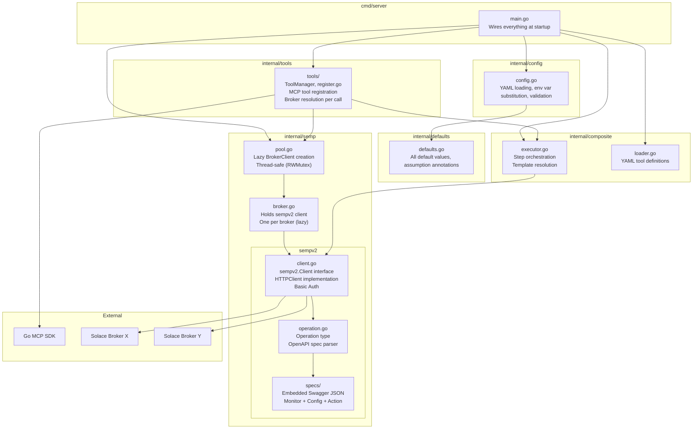
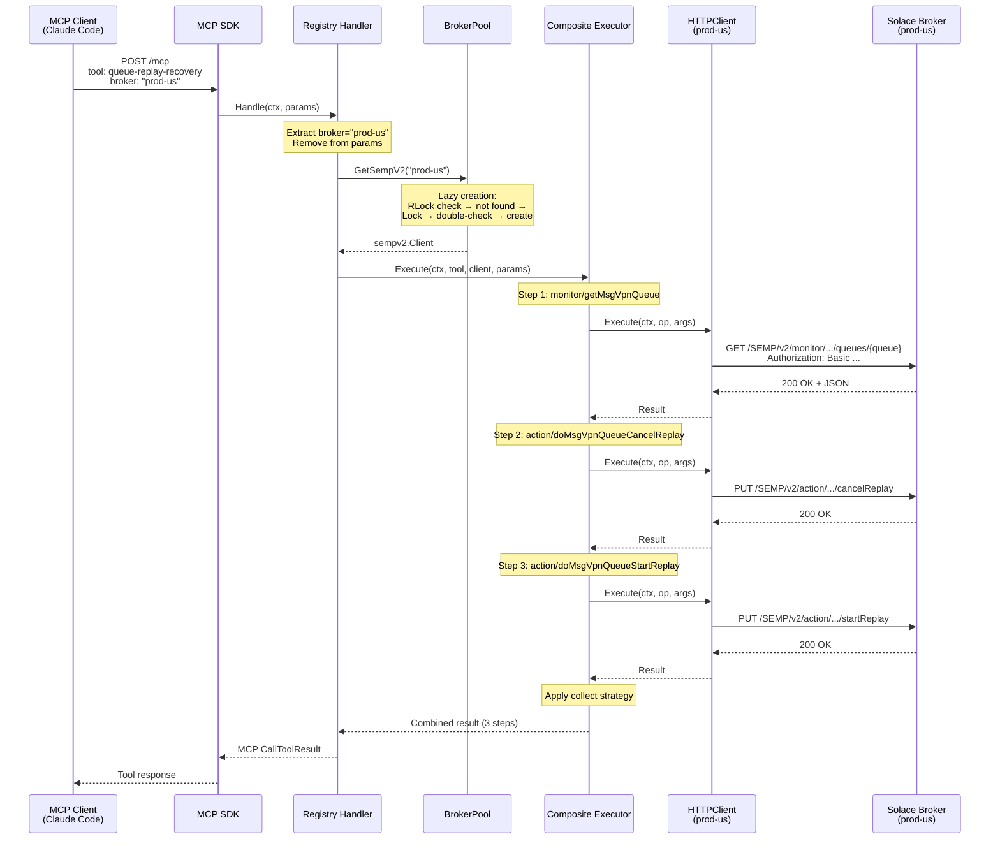
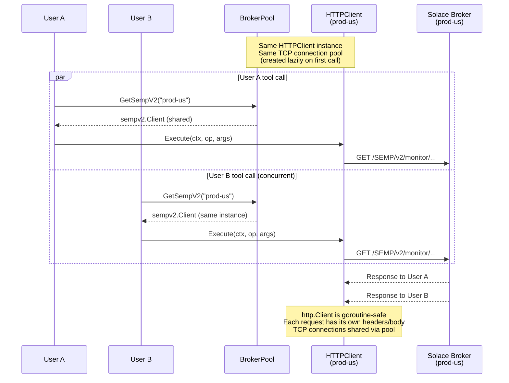
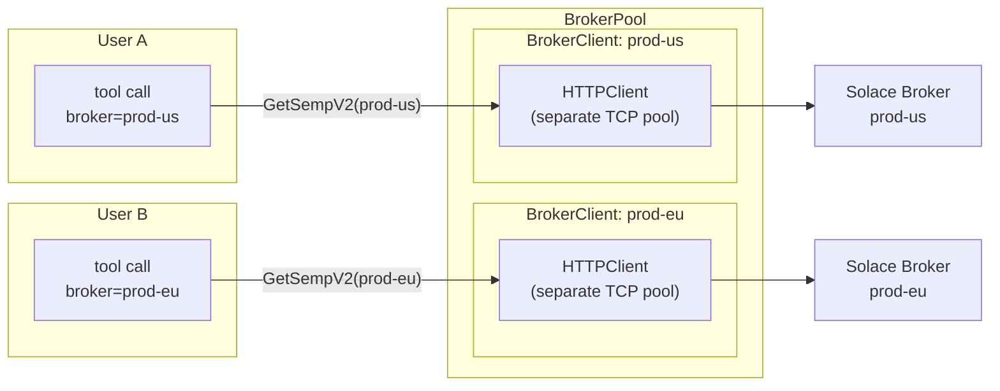

# Architecture — Solace Broker MCP Server

This document describes the architecture as implemented.

---

## Package Structure

One line per package; for current file-level detail, read the package itself.

```
cmd/server/            Entry point — config loading, auth middleware, MCP server startup
internal/
├── auth/              Client (inbound) auth: OAuth/OIDC JWT validation, static dev token, mode banner
├── config/            YAML config, ${VAR} env substitution, validation, broker alias canonicalization
├── defaults/          All default values, with assumption annotations
├── semp/              BrokerPool + BrokerClient — lazy per-broker client creation, thread-safe (RWMutex)
│   ├── auth/          Broker (outbound) auth
│   ├── resilience/    Rate limiting, retries, cookie jar
│   ├── sempv1/        SEMPv1 client — XML envelope protocol
│   └── sempv2/        SEMPv2 client — HTTP + embedded OpenAPI specs (monitor, config, action)
├── composite/         YAML-driven composite tool engine: loader, validator, step executor
│   └── definitions/   tools.yaml — composite tool definitions (source of truth for the tool list)
├── tools/             MCP registration, routing, param validation, identity extraction
│   └── sempv1/        Native Go tool handlers, one package per tool
└── version/           Build version stamping
```

The full tool list is defined by `internal/composite/definitions/tools.yaml`
(composite) plus the packages under `internal/tools/sempv1/` (native) — count
them there, not here.

---

## Component Overview




---

## Request Flow — Single Tool Call



---

## Concurrency — Multiple Users, Same Broker



---

## Concurrency — Multiple Users, Different Brokers



Completely independent — load on prod-us does not affect prod-eu.

---

## Key Design Decisions

| Decision | Why |
|---|---|
| **Lazy broker client creation** | With 500 configured brokers, only active ones allocate HTTP clients and TCP connections |
| **sempv2.Client is an interface** | Enables mock testing of executor without HTTP; enables future OAuth wrapper without changing executor |
| **Operation IDs prefixed with spec type** | `monitor/getMsgVpnQueue` vs `config/getMsgVpnQueue` — 150+ duplicate operationIds across specs are disambiguated |
| **$ref parameters resolved at parse time** | Shared query params (select, where, count, cursor) are available to all operations, not silently lost |
| **Handler resolves broker, executor receives client** | Executor is pure orchestration — no knowledge of brokers, auth, or pools. Auth changes (OAuth) don't touch executor. |
| **Broker param is always required** | No default broker concept. The LLM always specifies which broker to target. |

---

## Component Responsibilities

| Component | Knows about | Does NOT know about |
|---|---|---|
| **Registry Handler** | BrokerPool, broker aliases, MCP SDK, composite executor | HTTP calls, SEMP protocol |
| **Composite Executor** | Tool definitions, steps, templates, result strategies | Brokers, HTTP, auth |
| **BrokerClient** | sempv2 client | Tools, steps, MCP protocol |
| **sempv2.HTTPClient** | HTTP calls, auth headers, JSON parsing | Tools, brokers, MCP protocol |
| **BrokerPool** | Map of configs, lazy client creation, RWMutex | Tools, MCP protocol, HTTP details |
| **Config** | YAML parsing, env var substitution (${VAR_NAME}), validation | Everything else |

---
